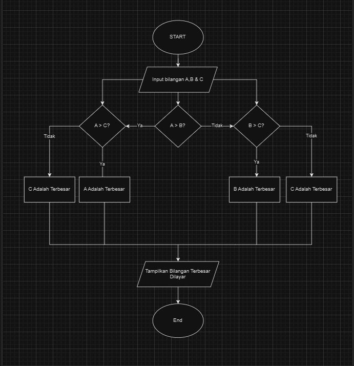
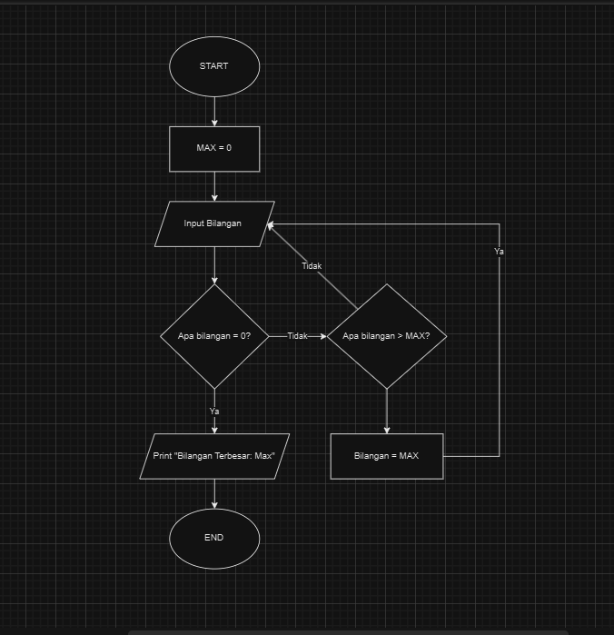

# Program Mencari Bilangan Terbesar Dari 3 Bilangan
Program sederhana untuk mencari nilai terbesar dari 3 bilangan yang diinputkan.

# Program Mencari Bilangan Terbesar Menggunakan Looping Sederhana
Program sederhana untuk mencari nilai terbesar dari sekumpulan bilangan yang diinputkan menggunakan looping sederhana menggunakan while dan break statement.

